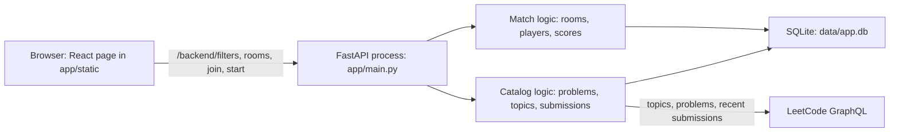
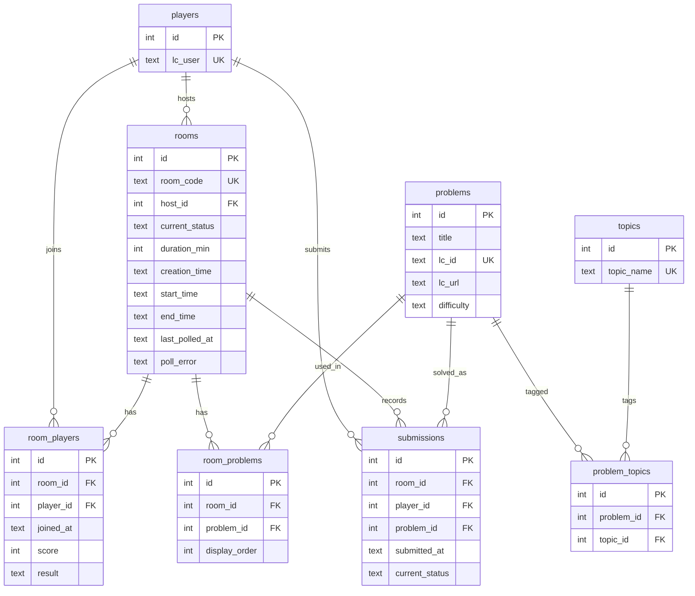

# LeetCode Versus

Assignment 1 report. Sections marked **YOU FILL** are personal claims I cannot take from the repo: the SDLC name, the goals, and the exact prompts.

## 1. What the app is

LeetCode Versus is a timed match for people who already practice on LeetCode. One player creates a room, picks a duration (1–180 minutes), a difficulty, one topic, and how many problems (1–10). The app checks that the LeetCode username exists, pulls free problems for that filter, and issues a 6-letter room code. A second player joins with the code. The host starts the match. Both solve on leetcode.com. Every few seconds the server reads each player's public recent submissions, keeps the ones that fall inside the match window and match the room's problems, and adds one point for a new accepted solve. When the clock ends, the higher score wins. A tie at the top is a shared win. A score of zero is a loss.

The people this is for are students practicing interviews in pairs, not a platform and not a class of thousands. A room is a handful of players. The interesting load is LeetCode's public API, which only returns about 20 recent submissions per list, not the size of the SQLite file.

## 2. SDLC

> **YOU FILL.** Name the model and the SMART goals in your own words. Below the box is only the commit record, so you can check your write-up against what actually happened.

Commits on `main`, by day:

| Day | Commits | What landed |
|---|---|---|
| 2026-09-28 | `52b3265` | Idea, first notes, database sketch |
| 2026-09-29 | `666bf51`, `1cd62ec` | `app/schema.sql` and the topic join-table decision |
| 2026-09-30 | `d5d8ca1` | Package layout under `app/` |
| 2026-10-01 | `d4443e6` | SQLAlchemy models, router stubs, Vite app |
| 2026-10-02 | `d5fc0d7` | A small edit to the assignment notes |
| 2026-10-03 | `57c9a54` | Room creation started |
| 2026-10-04 | six commits, ending at `c0d8a5c` | Services, API, then the page |

That is 13 commits across 7 calendar days. Six of the 13 are on 4 Oct, which is under 40% of the history. The work moved schema, then structure, then models, then room creation, then the rest of the API, then the page. It did not move as one planned release with a written sprint goal.

> **YOU FILL:**
>
> Model I chose: `[[FILL]]`
>
> SMART goals I set at the start: `[[FILL]]`
>
> Where I followed that model: `[[FILL]]`
>
> Where I did not: `[[FILL. The 4 Oct cluster, the commit message "some changes", and the missing tests are the obvious gaps.]]`

## 3. Architecture

One process. FastAPI starts in `app/main.py`, creates tables from `app/schema.sql`, mounts the API under `/backend`, and serves `app/static` for the page and its assets.

The page is not a second server in production. `frontend/leetcode_vs` is the source. `vite.config.ts` builds it into `app/static` with `base: '/static/'`. `GET /` returns `app/static/index.html`.

Configuration is environment variables read in `app/config.py`: `HOST` (`0.0.0.0`), `PORT` (`8000`), `DATA_DIR` (`data`). No setup prompt runs at startup.

### Match domain

Owns who is playing and whether the room is `Created`, `Active`, `Inactive`, or `Finished`.

- `create_room` validates the settings, verifies the host on LeetCode, stores a `rooms` row and a `room_players` row, and asks the catalog for problems.
- `join_room` adds another `room_players` row. A lobby that sits in `Created` longer than `duration_min` becomes `Inactive` in `expire_inactive_lobby`.
- `start_room` only works for the host, only from `Created`, and only with at least two players. It sets `start_time` and `end_time`.
- `assign_match_results` runs when the clock is up. Highest `score` wins. A tie at that score shares `Winner`. Everyone else, including a zero, is `Loser`.

### Catalog domain

Owns which problems are in the match and which solves count.

- `list_match_filters` loads LeetCode topic tags into `topics`.
- `add_problems_to_room` resolves the requested topic, fetches free questions of that difficulty, stores them with `upsert_problem`, and links a random sample through `room_problems`. If LeetCode fails, it falls back to problems already in SQLite (`local_problem_ids`).
- `get_room` polls while the match is `Active`. `get_leetcode_player_submissions` reads `recentSubmissionList` and `recentAcSubmissionList`. `record_match_submissions` keeps attempts inside `start_time` and `end_time` whose slug is one of the room's problems. The first accepted solve of a problem adds 1 to `room_player.score`. A later wrong answer does not replace an accepted row.

The seam is `room_problems` plus those two calls. The match code does not know how a LeetCode question is fetched. The catalog code does not decide who the host is.

### What the browser does

`frontend/leetcode_vs/src/App.tsx` keeps `username`, `playerId`, `roomCode`, and `hostId` in `localStorage` under the key `leetcode_vs`. Creating a room posts `host_username`, `duration`, `problem_count`, `difficulty`, and `topics`. Joining posts `username`. While a room is open, the page calls `GET /backend/rooms/{roomCode}` every 5 seconds. The host sees **Start match** only when `playerId` equals `hostId` and the status is `Created`.

## 4. Database

`app/schema.sql` is what `init_db` runs. The diagram matches that file and ADR entry 3.

`difficulty` is `Easy`, `Medium`, or `Hard`. Room status is `Created`, `Active`, `Inactive`, or `Finished`. Submission status is `Accepted`, `Wrong_Answer`, `Time_Limit`, or `Pending`. A player's result in a room is `Created`, `In_Progress`, `Winner`, or `Loser`. Timestamps are UTC ISO strings in `TEXT` columns. Foreign keys are on, including `ON DELETE CASCADE` from rooms and players onto the link tables.

`Research/Database.png` is the earlier sketch. The schema above is the one the app runs. If the picture still shows a topic string on `problems`, or different status names, it is behind `app/schema.sql`.

## 5. How a match moves

1. The page loads `GET /backend/filters`. Topic names are stored in `topics`.
2. The host submits the form. `create_room` writes `rooms`, `room_players`, `problems`, `problem_topics`, and `room_problems`. Status is `Created`.
3. The other player posts to `/join`. Their LeetCode username is verified the same way.
4. The host starts. Status becomes `Active`, and each `room_players.result` becomes `In_Progress`.
5. Each poll of `get_room` may insert `submissions` and bump `score`.
6. After `end_time`, status becomes `Finished` and `assign_match_results` sets `Winner` or `Loser`.

A lobby that nobody starts becomes `Inactive` once `duration_min` has passed since `creation_time`. Joining or starting an inactive room is rejected.

## 6. What I left out

There is no account system and no editor. The score depends on a public LeetCode username, so a second password would not decide who solved the problem. Code runs on LeetCode, not here. The page polls. It does not hold a WebSocket. ADR entry 5 is that decision.

`python -m pytest --cov=app.domain.backend.services --cov-report=term-missing` covers that module at 100%. The tests call the match and scoring functions and mock LeetCode. ADR entry 4 is that decision.

## 7. AI disclosure

> **YOU FILL** the bracketed prompts so this matches chats you actually sent. The systems and the rough use are filled from your description and from commit `1a77ba4`.

I acknowledge the use of Nebula One and Cursor to draft and check this project. Nebula One, in the project at `https://nebulaone.ie.edu/chat/projects/1637cac5-53e3-4702-8bca-88e34df392bb`, was where I asked questions while I was designing the schema and the API. Cursor was what I used on the later commits, including fixing errors in `app/domain/backend/services.py` (`1a77ba4`) and building the page (`c0d8a5c`). The prompts used include [[FILL: short list, the same ones you paste into `AI_USAGE.md`]]. The output of these prompts was used to [[FILL: for example, compare a join table with a topic string, debug a service error, generate the React room page]]. I rewrote the parts I kept, and the "in my own words" column of `AI_USAGE.md` is mine. The detailed log is `AI_USAGE.md`.
