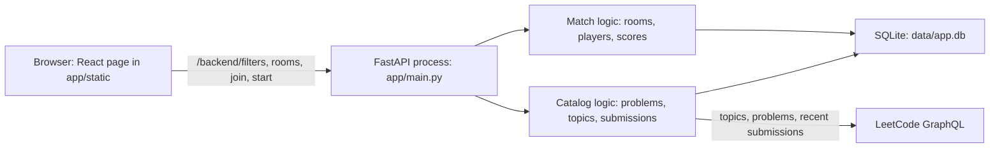
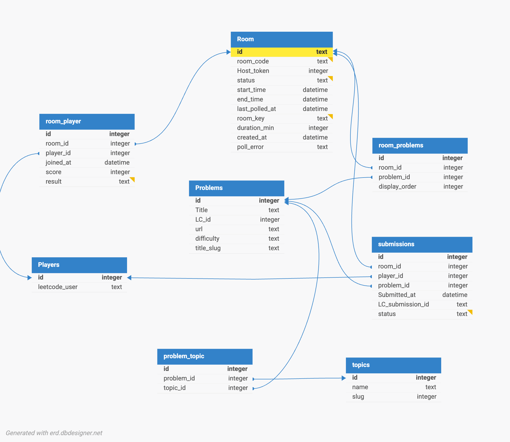

# LeetCode Versus

Github URL: https://github.com/agarcia246/leetcode_versus
## 1. What the app is

LeetCode Versus is a timed match for people to compete in leetcode challenges. One player creates a room, picks a duration, a difficulty, one topic, and how many problems. The app checks that the LeetCode username exists, pulls free problems for that filter, and issues a 6-letter room code. Once a second player joins with the code, The host starts the match. Both solve on leetcode.com. Every few seconds the server reads each player's public recent submissions, keeps the ones that fall inside the match window and match the room's problems, and adds one point for a new accepted solve. When the clock ends, the higher score wins. A tie at the top is a shared win. A score of zero is a loss.

## 2. SDLC

I used an iterative, incremental model. Each day from 28 September to 3 October added one slice of the product, and the next day started from what was already in the repo. That fits this assignment: the app is small, the two domains only became clear once the schema existed, and the written record (ADR entries, commits) is supposed to show decisions as they were made. A locked specification on day one would have guessed the scoring rules before `record_match_submissions` existed.

SMART goals I was working toward, deadline 4 October 2026:

| | Goal |
|---|---|
| Specific | Two players can create a room, join with a code, start a timed match, and get a winner from public LeetCode accepts. |
| Measurable | Both domains read and write SQLite. `app/domain/backend/services.py` is covered by pytest at 70% or better. History has at least 12 commits on at least 6 days. |
| Achievable | One process, no in-app editor, no second account system. The page polls every 5 seconds. |
| Relevant | The same app has to satisfy the single-container contract so Assignment 2 can deploy it unchanged. |
| Time-bound | Done by 4 October 2026, 23:59. |

What landed, by day. This is the 14 commits on the main line, not stash entries:

| Day | Commits | What landed |
|---|---|---|
| 2026-09-28 | `52b3265` | Idea, first notes, database sketch |
| 2026-09-29 | `666bf51`, `1cd62ec` | `app/schema.sql` and the topic join-table decision |
| 2026-09-30 | `d5d8ca1` | Package layout under `app/` |
| 2026-10-01 | `d4443e6` | SQLAlchemy models, router stubs, Vite app |
| 2026-10-02 | `d5fc0d7` | A small edit to the assignment notes |
| 2026-10-03 | `57c9a54` | Room creation |
| 2026-10-04 | seven commits, `9b2f6a5` through `2d99463` | Services, API, the page, then tests |

Where that matches the model: the schema was committed before the API, the package split was committed before the models, and room creation was a working slice on 3 October before the rest of the service file. ADR entry 1 is dated with the idea, entry 3 with the schema, entry 2 with the package layout. The product goals are met: one process, SQLite, two domains, and `python -m pytest --cov=app.domain.backend.services --cov-report=term-missing` reports 100% on that module.

Where it does not: 2 October does not add a product slice. The commit message is "some changes" and the diff is the assignment notes. Testing was the last slice, on the deadline day, instead of a check after room creation. Seven of the fourteen commits are on 4 October, so half the history landed on one day. The services, the finished API, the page, and the tests were one long increment, which is the opposite of the one-slice-per-day pace of the first week.

## 3. Architecture

One process. FastAPI starts in `app/main.py`, creates tables from `app/schema.sql`, mounts the API under `/backend`, and serves `app/static` for the page and its assets.

The page is not a second server in production. `frontend/leetcode_vs` is the source. `vite.config.ts` builds it into `app/static` with `base: '/static/'`. `GET /` returns `app/static/index.html`.

Configuration is environment variables read in `app/config.py`: `HOST` (`0.0.0.0`), `PORT` (`8000`), `DATA_DIR` (`data`). No setup prompt runs at startup.

### Match domain

Owns who is playing and whether the room is `Created`, `Active`, `Inactive`, or `Finished`.

- `create_room` validates the settings, verifies the host on LeetCode, stores a `rooms` row and a `room_players` row, and asks the catalog for problems.
- `join_room` adds another `room_players` row. A lobby that sits in `Created` longer than `duration_min` becomes `Inactive` in `expire_inactive_lobby`.
- `start_room` only works for the host, only from `Created`, and only with at least two players. It sets `start_time` and `end_time`.
- `assign_match_results` runs when the clock is up. Highest `score` wins. A tie at that score shares `Winner`. Everyone else, including a zero, is `Loser`.

### Catalog domain

Owns which problems are in the match and which solves count.

- `list_match_filters` loads LeetCode topic tags into `topics`.
- `add_problems_to_room` resolves the requested topic, fetches free questions of that difficulty, stores them with `upsert_problem`, and links a random sample through `room_problems`. If LeetCode fails, it falls back to problems already in SQLite (`local_problem_ids`).
- `get_room` polls while the match is `Active`. `get_leetcode_player_submissions` reads `recentSubmissionList` and `recentAcSubmissionList`. `record_match_submissions` keeps attempts inside `start_time` and `end_time` whose slug is one of the room's problems. The first accepted solve of a problem adds 1 to `room_player.score`. A later wrong answer does not replace an accepted row.

The seam is `room_problems` plus those two calls. The match code does not know how a LeetCode question is fetched. The catalog code does not decide who the host is.

### What the browser does

`frontend/leetcode_vs/src/App.tsx` keeps `username`, `playerId`, `roomCode`, and `hostId` in `localStorage` under the key `leetcode_vs`. Creating a room posts `host_username`, `duration`, `problem_count`, `difficulty`, and `topics`. Joining posts `username`. While a room is open, the page calls `GET /backend/rooms/{roomCode}` every 5 seconds. The host sees **Start match** only when `playerId` equals `hostId` and the status is `Created`.

## 4. Database

`app/schema.sql` is what `init_db` runs. This is that schema, and it matches ADR entry 3.

`difficulty` is `Easy`, `Medium`, or `Hard`. Room status is `Created`, `Active`, `Inactive`, or `Finished`. Submission status is `Accepted`, `Wrong_Answer`, `Time_Limit`, or `Pending`. A player's result in a room is `Created`, `In_Progress`, `Winner`, or `Loser`. Timestamps are UTC ISO strings in `TEXT` columns. Foreign keys are on, including `ON DELETE CASCADE` from rooms and players onto the link tables.

## 5. How a match moves

1. The page loads `GET /backend/filters`. Topic names are stored in `topics`.
2. The host submits the form. `create_room` writes `rooms`, `room_players`, `problems`, `problem_topics`, and `room_problems`. Status is `Created`.
3. The other player posts to `/join`. Their LeetCode username is verified the same way.
4. The host starts. Status becomes `Active`, and each `room_players.result` becomes `In_Progress`.
5. Each poll of `get_room` may insert `submissions` and bump `score`.
6. After `end_time`, status becomes `Finished` and `assign_match_results` sets `Winner` or `Loser`.

A lobby that nobody starts becomes `Inactive` once `duration_min` has passed since `creation_time`. Joining or starting an inactive room is rejected.

## 6. What I left out

There is no account system and no editor. The score depends on a public LeetCode username, so a second password would not decide who solved the problem. Code runs on LeetCode, not here. The page polls. It does not hold a WebSocket. ADR entry 5 is that decision.

`python -m pytest --cov=app.domain.backend.services --cov-report=term-missing` covers that module at 100%. The tests call the match and scoring functions and mock LeetCode. ADR entry 4 is that decision.

## 7. AI disclosure

I acknowledge the use of Nebula One and Cursor to draft and check this project. Nebula One, at `https://nebulaone.ie.edu/chat/projects/1637cac5-53e3-4702-8bca-88e34df392bb`, was where I asked questions while designing the schema and the API. Cursor was what I used on the later commits, including fixing `app/domain/backend/services.py` (`1a77ba4`), finishing the router, building the page (`c0d8a5c`), and writing the tests (`2d99463`). The prompts used include "explain to me where I should write my code for my database and how i should set up the database", "where should I store the id of the admin of the room", "fix issues in services.py", "finish the router.py", the 4 October request to fetch LeetCode problems and check usernames, "build me the fronted in the frontend src file. keep it simple", "make the frontend actually usable", and "fix these issues". The output of these prompts was used to put the schema in `app/schema.sql`, store the host on `rooms.host_id`, implement `create_room`, `get_room`, and `record_match_submissions`, serve the React page from `app/static`, and add the pytest suite. The row-by-row log is `AI_USAGE.md`. The exact wording of the Nebula questions was not exported from that project.
